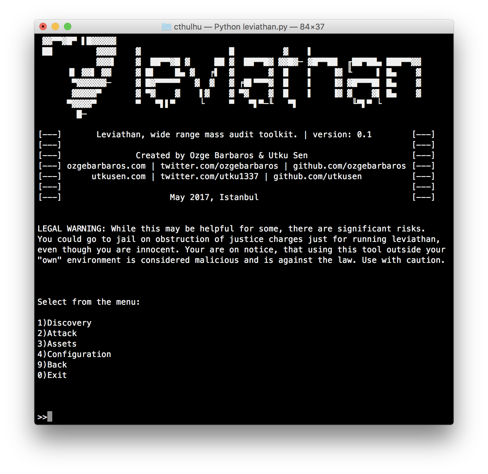
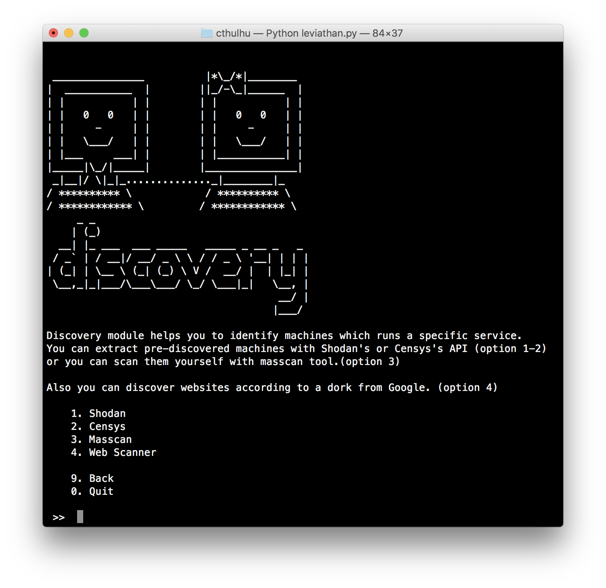
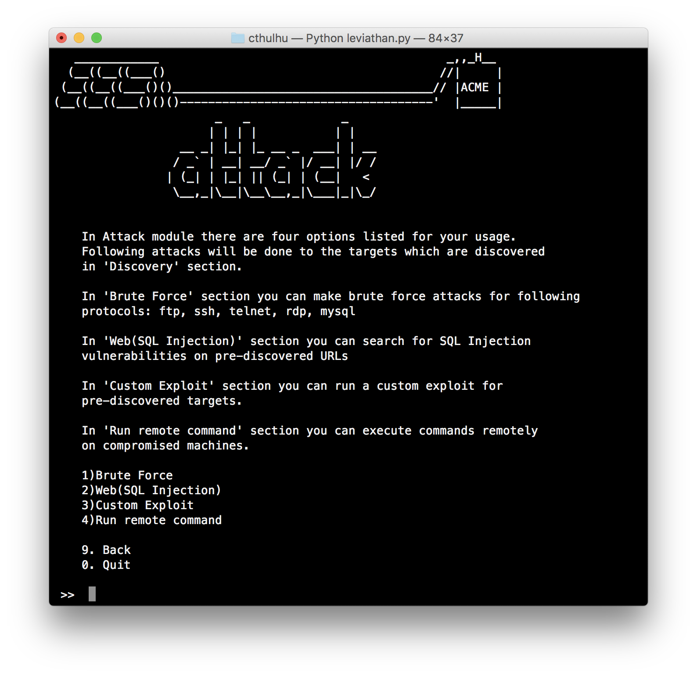
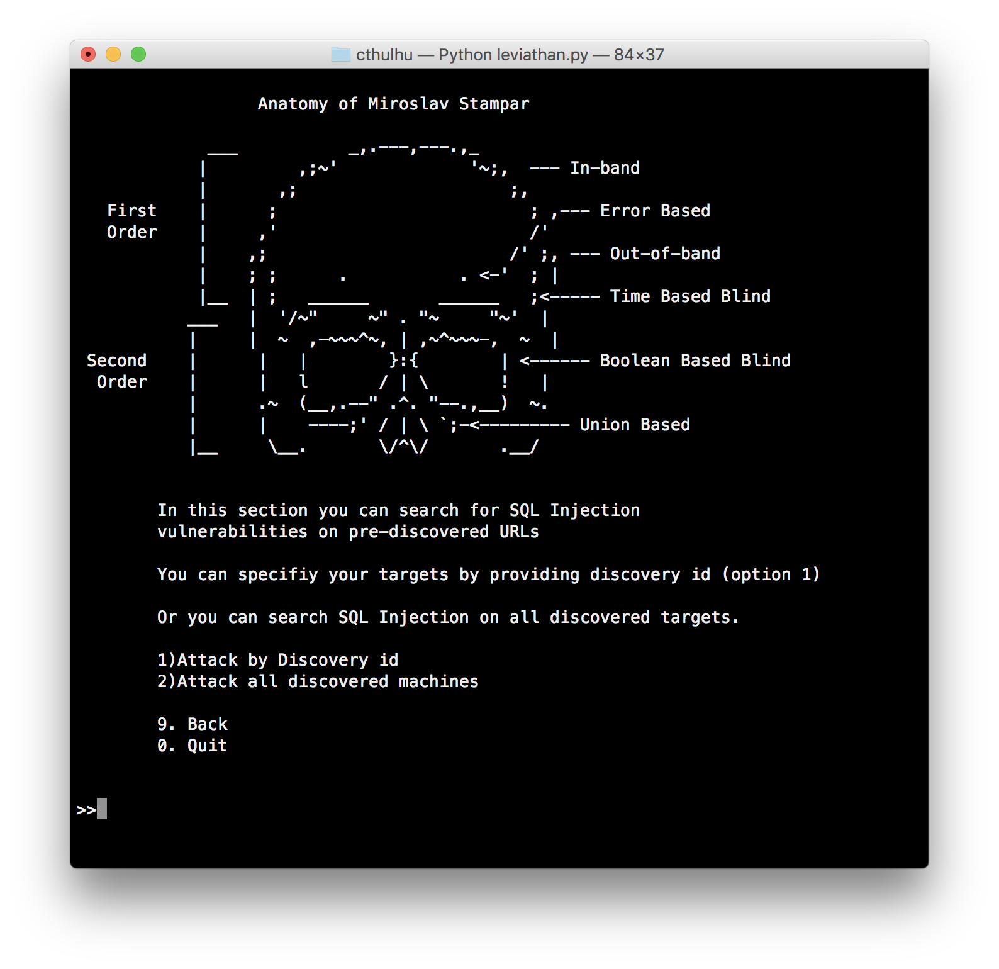
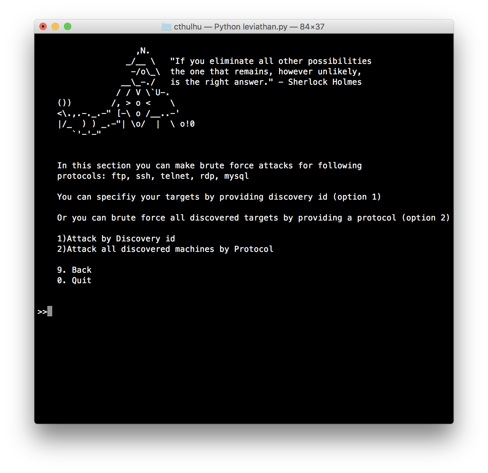
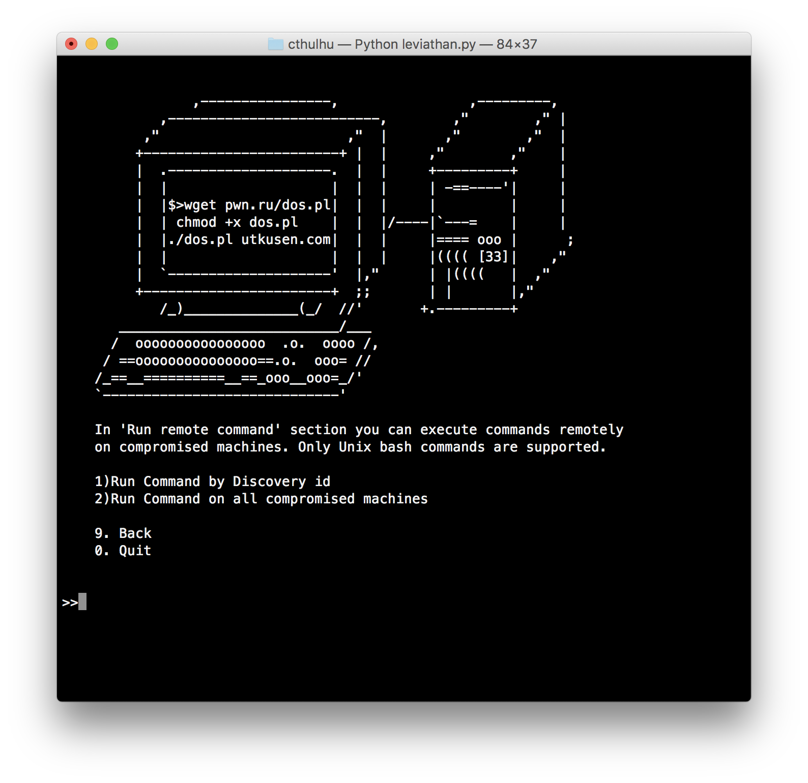

</img>

 <a href="https://www.defcon.org/html/defcon-25/dc-25-demolabs.html"> 

Leviathan is a mass audit toolkit which has wide range service discovery, brute force, SQL injection detection and running custom exploit capabilities. It consists open source tools such masscan, ncrack, dsss and gives you the flexibility of using them with a combination.

The main goal of this project is auditing as many system as possible in country-wide or in a wide IP range.

## Main Features

**Discovery**: Discover FTP, SSH, Telnet, RDP, MYSQL services running inside a specific country or in an IP range via Shodan, Censys. It's also possible to manually discover running services on a IP range by integrated “masscan” tool. 

Short Demo: https://asciinema.org/a/617bsxl1y84bav9f5bcwllx7r

**Brute Force**: You can brute force the discovered services with integrated “ncrack” tool. It has wordlists which includes most popular combinations and default passwords for specific services.

Short Demo: https://asciinema.org/a/43y2j38zu7hbnuahrj233d5r0

**Remote Command Execution**: You can run system commands remotely on compromised devices.

Short Demo: https://asciinema.org/a/0xcrhd12f2lpkbktjldwtab16

**SQL Injection Scanner**: Discover SQL injection vulnerabilities on websites with specific country extension or with your custom Google Dork.

Short Demo: https://asciinema.org/a/2mwfmd9afsuyg5p0vzcq5e6si

**Exploit Specific Vulnerabilities**: Discover vulnerable targets with Shodan, Censys or masscan and mass exploit them by providing your own exploit or using preincluded exploits.

Short Demo: https://asciinema.org/a/9uqsjvnru780h0ue6ok9j9ktb

## Integrated Tools

**Masscan**: It’s a very fast TCP port scanner by Robert David Graham. Leviathan uses masscan for detecting services on a huge IP range. https://github.com/robertdavidgraham/masscan

**Ncrack**: Ncrack is a high-speed network authentication cracking tool. Leviathan uses ncrack to brute force services such as FTP, SSH, RDP, Telnet, MYSQL etc. https://github.com/nmap/ncrack

**DSSS (Damn Small SQLi Scanner)**: DSSS is a fully functional and minimal SQL injection vulnerability scanner by Miroslav Stampar. Leviathan uses DSSS to identify SQL Injection vulnerabilities on specific URLs. https://github.com/stamparm/DSSS

## Installation
For detailed installiation, please visit our [wiki](https://github.com/leviathan-framework/leviathan/wiki) page.

### Kali Linux:

Download leviathan by cloning the Git repository:

`git clone https://github.com/leviathan-framework/leviathan.git`

Go inside the folder

`cd leviathan`

Install Python libraries:

`pip install -r requirements.txt`

It's done!

### Debian/Ubuntu:

Download leviathan by cloning the Git repository:

`git clone https://github.com/leviathan-framework/leviathan.git`

Go inside the folder

`cd leviathan`

Run installiation script. It will setup required tools (ncrack, masscan) and python libraries.

`bash scripts/debian_install.sh`

It's done!

### macOS:

If homebrew is not installed on your system, please install it first:

`/usr/bin/ruby -e "$(curl -fsSL https://raw.githubusercontent.com/Homebrew/install/master/install)"`

Download leviathan by cloning the Git repository:

`git clone https://github.com/leviathan-framework/leviathan.git`

Go inside the folder

`cd leviathan`

Run installiation script. It will setup required tools (ncrack, masscan) and python libraries.

`bash scripts/macos_install.sh`

It's done!

### Requirements
Python version 2.7.x is required for running this program.

**Supported platforms**: Linux (Kali Linux, Debian, Ubuntu), macOS

## Usage
Run the program with following command: 

`python leviathan.py`

You can get basic usage information inside the menus. For detailed usage manual, visit our [wiki](https://github.com/leviathan-framework/leviathan/wiki) page.

## Screenshots

</img> 
</img> 
</img>
</img>
</img>
</img>

## Authors
This project is written by Utku Sen and Ozge Barbaros

# Legal Warning

While this may be helpful for some, there are significant risks.
You could go to jail on obstruction of justice charges just for running leviathan,
even though you are innocent. Your are on notice, that using this tool outside your
"own" environment is considered malicious and is against the law. Use with caution.
